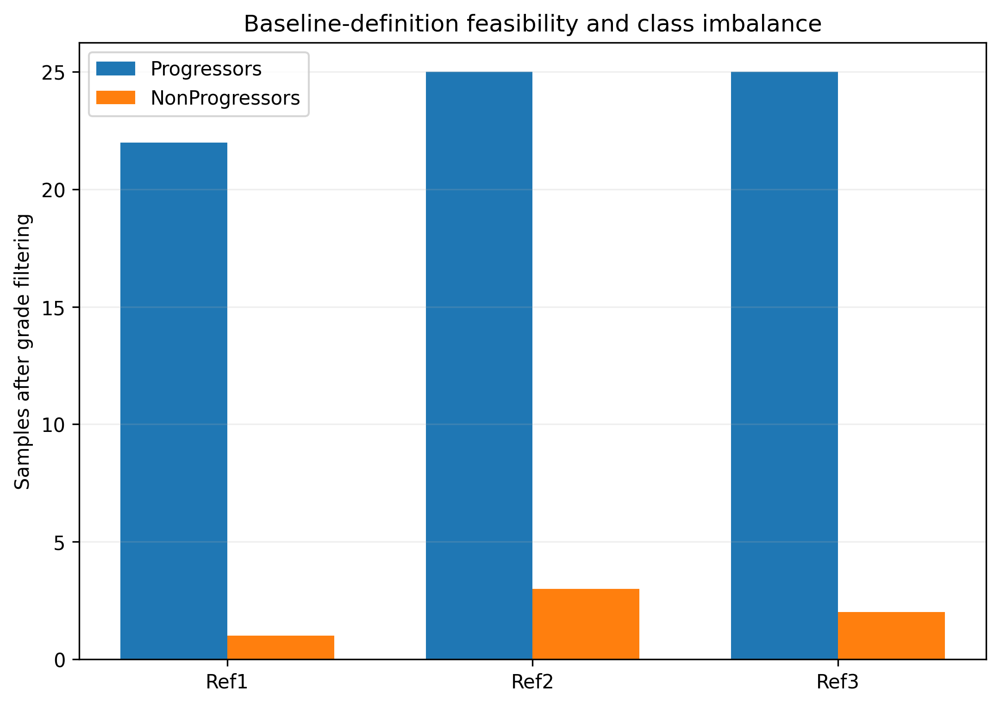
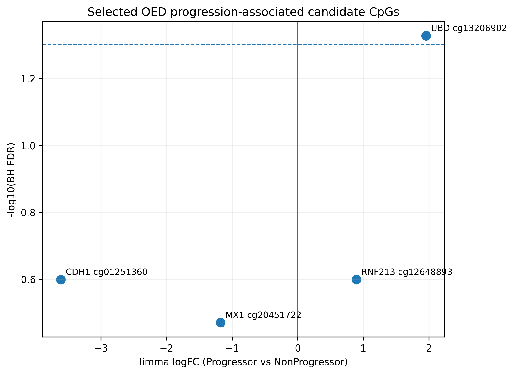
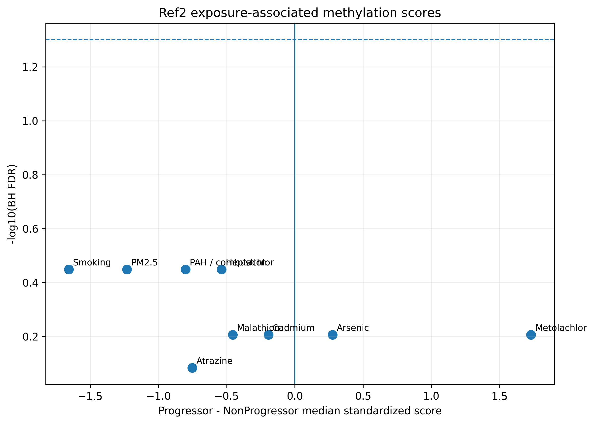
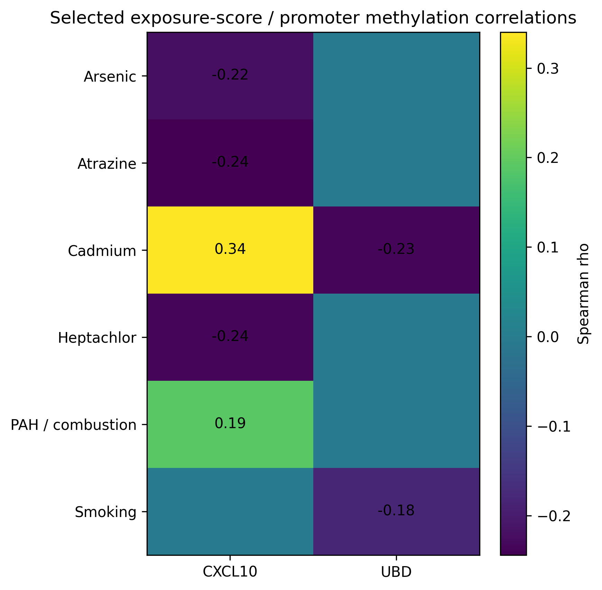

# OED-to-OSCC Epigenomic Progression

Reproducible Illumina EPIC methylation analysis of oral epithelial dysplasia (OED) lesions, integrating progression status, lesion grade, candidate OSCC biology, spatial-transcriptomic candidates, exposure-associated methylation signatures, and within-patient lesion trajectories.

## Scientific question

Can baseline methylation patterns in OED help distinguish lesions from patients who later progress to oral squamous cell carcinoma (OSCC), and do those methylation changes intersect with known OSCC biology, spatial-transcriptomic candidates, or exposure-associated epigenetic patterns?

## Study architecture

```text
Illumina EPIC methylation
        |
QC-filtered beta / M-value matrices
        |
clinical + lesion chronology harmonization
        |
Ref1 / Ref2 / Ref3 baseline definitions
        |
primary Ref2 progression cohort
        |
grade-adjusted limma
+ duplicateCorrelation when needed
        |
CpG-level differential methylation
        |
+----------------------+-----------------------+
|                      |                       |
known OSCC genes       CosMx candidates        exposure signatures
CDKN2A / CDH1          promoter context        9 usable signatures
gene / region summaries spatial integration    full-cohort correlations
|                      |                       |
+----------------------+-----------------------+
        |
effect-size + robustness analyses
        |
within-patient lesion trajectories
```

## Dataset and cohort

- 92 QC-passed methylation samples
- 705,131 retained CpGs
- 342 known-OSCC candidate CpGs
- 355 CosMx candidate CpGs
- Primary Ref2 cohort: 25 Progressors vs 3 NonProgressors

Ref2 is the only baseline definition with enough NonProgressor samples for exploratory inferential modeling. Ref1 and Ref3 are retained as descriptive sensitivity definitions.

## Primary statistical model

Differential methylation is modeled on M-values using:

```text
M-value ~ Progression + Grade
```

`limma` is used for CpG-level inference, with `duplicateCorrelation` when repeated samples from the same patient require within-patient correlation to be modeled.

- M-values: statistical testing
- beta values: effect sizes and visualization
- BH FDR: multiple-testing control
- delta-beta: biological effect-size prioritization

Because the Ref2 comparison is highly imbalanced, nominal results are treated as exploratory unless they survive multiple-testing correction.

## Key findings

### Known OSCC genes

No known-OSCC candidate CpG reached FDR < 0.05.

The strongest nominal candidate was:

- **CDH1 cg01251360**
- logFC = -3.61
- P = 7.37e-4
- FDR = 0.252

CDKN2A showed a broader directionally negative methylation pattern in Progressors but no individually FDR-significant CpG.

### CosMx / spatial-transcriptomic candidates

The strongest adjusted CpG-level result was:

- **UBD cg13206902**
- logFC = 1.957
- P = 1.32e-4
- FDR = 0.047

This is the only candidate CpG in the current candidate-focused analysis that passes the formal FDR threshold.

Other genes such as RNF213, MX1, IFI6, XAF1, EPSTI1, OAS3, CXCL10, and related immune/interferon candidates remain hypothesis-generating.

### Exposure-associated methylation signatures

Nine usable exposure-associated signatures were evaluated:

- arsenic
- atrazine
- cadmium
- heptachlor
- malathion
- metolachlor
- PAH / combustion
- PM2.5
- smoking

These scores are **methylation patterns associated with exposures in prior studies**, not direct environmental dose measurements.

In the current Ref2 comparison:

- 0 signatures had nominal P < 0.05
- 0 signatures had BH FDR < 0.05

PAH/combustion and smoking had the smallest P values (both P = 0.0876; FDR = 0.356).

### Exposure-to-candidate correlations

Across all 92 methylation samples, the strongest current exposure/candidate correlation was:

- cadmium-associated score vs CXCL10 promoter methylation
- Spearman rho = 0.340
- P = 0.000906
- FDR = 0.0245

Correlated signatures may share CpGs or capture related biological responses, so they are not assumed to represent independent causal exposure effects.

### Longitudinal lesion audit

A specimen-level chronology audit identified no clean methylation-profiled dysplasia -> methylation-profiled SCC pair.

Three patients had evaluable Mild -> Severe dysplasia trajectories. These analyses are descriptive only.

Across the three trajectories:

- malathion-associated scores decreased in all three
- atrazine-associated scores decreased in all three
- the clinical progressor showed a marked metolachlor increase (+2.41 standardized-score units) and an arsenic increase (+1.28)

Because n = 3, these patterns are used for hypothesis generation rather than biomarker claims.


## Selected portfolio figures

These figures are privacy-safe aggregate summaries of the completed analysis and contain no patient-level methylation or clinical data.

### Baseline cohort feasibility



Ref2 provides the primary exploratory inferential cohort but remains strongly imbalanced at 25 Progressors versus 3 NonProgressors.

### Progression-associated candidate CpGs



UBD cg13206902 is the strongest FDR-supported candidate result. CDH1, RNF213, MX1, and other candidate loci remain exploratory.

### Exposure-associated methylation signatures



None of the tested exposure-associated methylation signatures reaches nominal or FDR significance in Ref2. These scores represent epigenetic exposure-associated patterns rather than direct exposure measurements.

### Exposure-to-promoter relationships



Full-cohort analyses evaluate whether exposure-associated methylation scores covary with promoter methylation of prioritized spatial and immune-related genes.


## Repository structure

```text
.
├── README.md
├── config/
├── data/
│   ├── README.md
│   └── synthetic/
├── docs/
├── scripts/
│   ├── R/
│   └── python/
└── results/
    ├── README.md
    ├── figures/
    └── tables/
```

## Active R workflow

1. `00_setup.R`
2. `01_build_baseline_cohorts.R`
3. `02_fit_primary_limma.R`
4. `03_effect_size_probe_context.R`
5. `04_known_oscc_cdkn2a.R`
6. `05_cosmx_spatial_integration.R`
7. `06_sensitivity_analyses.R`
8. `07_exposure_signature_scoring.R`
9. `08_exposure_progression_tests.R`
10. `09_exposure_candidate_correlations.R`
11. `10_longitudinal_trajectories.R`
12. `11_make_portfolio_outputs.R`

## Interpretation boundary

This is an exploratory observational methylation study with a strongly imbalanced primary cohort.

The results do not establish:
- causal exposure effects;
- a validated clinical progression biomarker;
- direct regulation of spatial-transcriptomic genes by promoter methylation;
- mechanistic progression from a specific methylation change to OSCC.

The strongest formal candidate result is UBD cg13206902. The broader known-OSCC, exposure, and longitudinal results are best treated as biologically motivated hypotheses for validation in larger and more balanced cohorts.

## Privacy

Restricted patient-level clinical and methylation data are not distributed here. Public code is designed around synthetic, public, aggregate, or otherwise approved inputs.


## License and reuse

This repository is shared for research transparency and portfolio demonstration. No open-source license is currently granted for reuse, redistribution, or derivative works. Please contact the author regarding reuse of code or materials.

