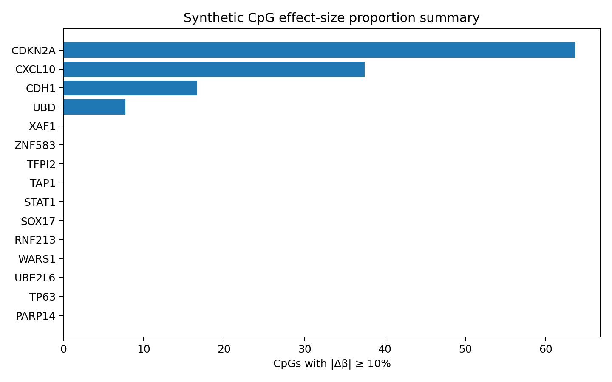
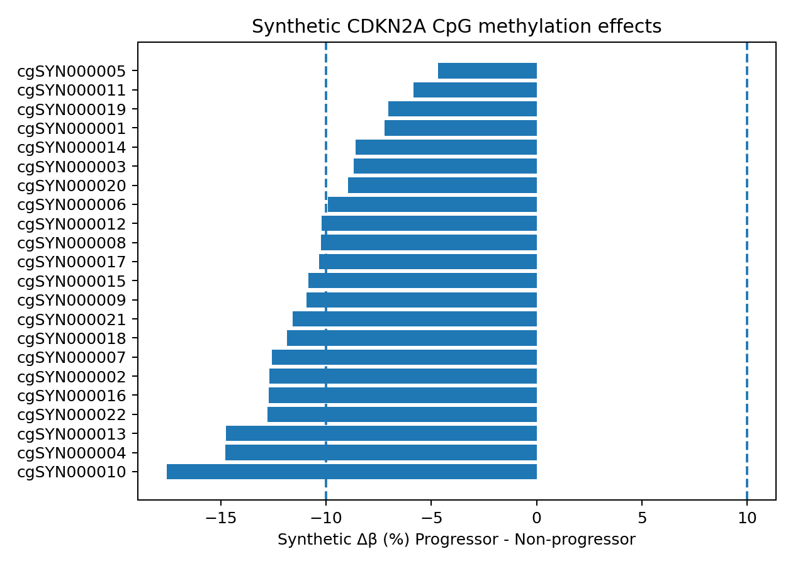
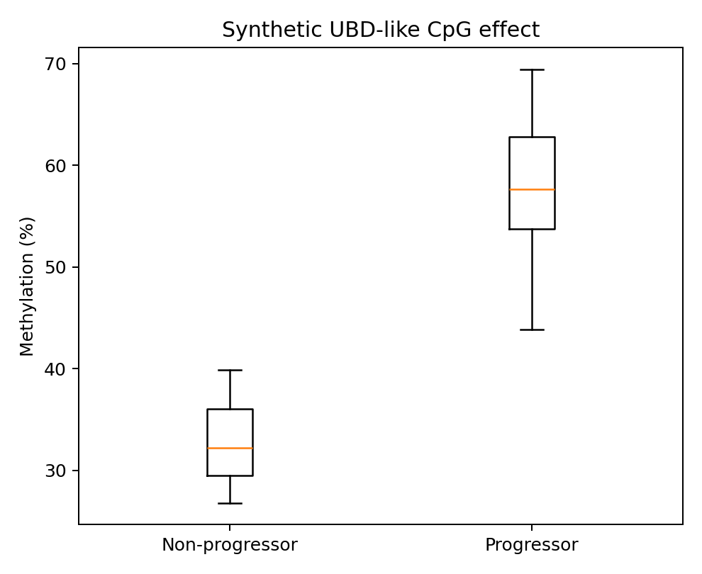
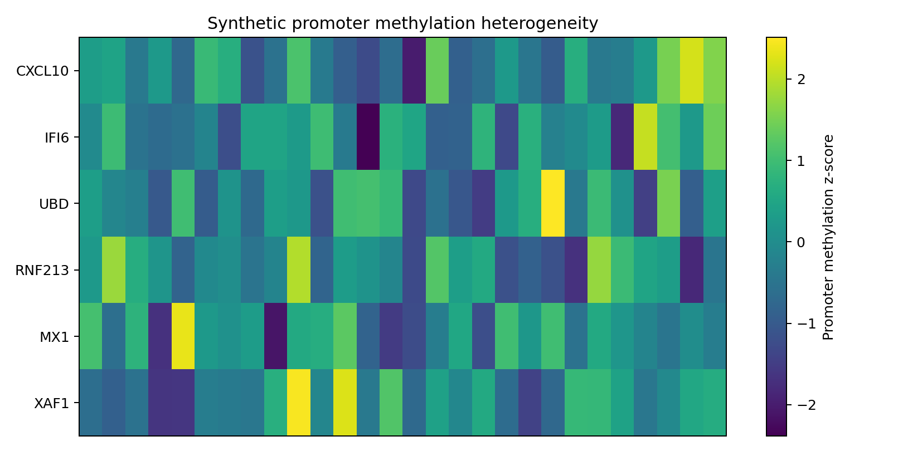

# OED → OSCC Epigenomic Progression

**EPIC DNA methylation analysis of baseline oral epithelial dysplasia (OED) associated with later progression to oral squamous cell carcinoma (OSCC).**

## Scientific question
Can baseline methylation features distinguish dysplastic lesions from patients who later progress to OSCC from lesions in non-progressors?

## Study architecture

```text
EPIC beta + M matrices
        |
        +--> sample/metadata alignment
        |
        +--> Ref1 / Ref2 / Ref3 baseline construction
                    |
                    +--> feasibility assessment
                    |
                    +--> Ref2 exploratory inference
                              |
                     M-values: limma
                     ~ progression + grade
                              |
                       BH-FDR across CpGs
                              |
              +---------------+---------------+
              |                               |
        Known OSCC genes                 CosMx genes
              |                               |
        CpG / region effects            promoter z-scores
              |                               |
              +---------- effect-size / sensitivity ----------+
```

## Real project scale

| Measure | Value |
|---|---:|
| QC-passed EPIC samples | 92 |
| CpGs retained after QC | 705,131 |
| Known OSCC candidate CpGs | 342 |
| CosMx candidate CpGs | 355 in the clean report |
| CosMx promoter CpGs | 193 |

The project used **M-values for statistical testing** and **beta values for visualization and delta-beta effect sizes**. Ref2 was the only baseline definition supporting exploratory inference: 25 progressors versus 3 non-progressors after grade filtering. Ref1 (22/1) and Ref3 (25/2) are descriptive.

## Baseline logic

See [`docs/BASELINE_DEFINITIONS.md`](docs/BASELINE_DEFINITIONS.md).

The analysis does not treat baseline definition as a trivial preprocessing choice. Different definitions change which dysplastic specimen represents each patient's precursor state and therefore change the estimand.

## Differential methylation

The candidate-CpG model is:

```r
design <- model.matrix(~ Progression + Grade, data = metadata)
```

When repeated samples from the same patient are present:

```r
corfit <- duplicateCorrelation(M_matrix, design, block = patient_id)
fit <- lmFit(M_matrix, design, block = patient_id,
             correlation = corfit$consensus)
fit <- eBayes(fit)
```

BH-FDR is applied across tested CpGs.

## Known OED/OSCC methylation genes

The literature-derived panel includes:

`CDKN2A`, `CDKN2B`, `CDH1`, `MGMT`, `PAX1`, `ZNF583`, `ATG5`, `MAP1LC3A`, `DAPK1`, `TP63`, `TFPI2`, `SOX17`, `GATA4`, `EGFR`, `PTK6`, `AIM2`, `CCNA1`, `CCNA2`, `CCNB1`, `CCNB2`.

### Real aggregate finding

No known-OSCC CpG reached FDR < 0.05. The strongest nominal result was **CDH1 cg01251360**:

| Gene | CpG | limma logFC | P | FDR |
|---|---|---:|---:|---:|
| CDH1 | cg01251360 | -3.61 | 7.37e-4 | 0.252 |

Negative logFC indicates lower methylation in progressors on the M-value scale. CDKN2A, EGFR, DAPK1, ATG5, TFPI2 and MGMT remain exploratory candidates rather than validated progression biomarkers.

## CpG effect-size summaries

Statistical significance is complemented by beta-scale effect size:

```text
delta-beta = mean(beta_progressor) - mean(beta_nonprogressor)
```

The **10% methylation threshold** is an effect-size summary:

```text
|delta-beta| >= 0.10
```

It asks what fraction of CpGs within a gene show at least a 10-percentage-point group difference. It is **not** a P-value cutoff and does not imply statistical significance.



*Synthetic reproducibility layer; not patient-cohort results.*

### CDKN2A

Expanded effect-size review in the real project showed coordinated lower methylation across many CDKN2A CpGs in progressors despite the absence of FDR-significant CpG-level evidence. This is best interpreted as a biologically interesting regional pattern requiring validation.



*Synthetic reproducibility layer.*

## Spatial transcriptomic / CosMx integration

A 26-gene CosMx list was used to ask whether genes identified by spatial expression also show methylation differences in the EPIC cohort.

The panel includes immune/interferon-related genes such as `CXCL9`, `CXCL10`, `CXCL11`, `IFI6`, `STAT1`, `RNF213`, `MX1`, `UBD`, `XAF1`, `TAP1`, and others.

Two analyses were performed:

1. Ref2 differential methylation across the available baseline cohort.
2. Promoter methylation z-scores for samples/patients represented in both methylation and spatial datasets.

### UBD

**UBD cg13206902** was the only CosMx CpG reaching FDR < 0.05 in the exploratory Ref2 model:

| Gene | CpG | limma logFC | P | FDR | Direction |
|---|---|---:|---:|---:|---|
| UBD | cg13206902 | 1.96 | 1.32e-4 | 0.047 | higher methylation in progressors |

This is the strongest adjusted methylation signal in the current candidate analyses, but it remains exploratory because the comparison contains only three non-progressors.



*Synthetic reproducibility layer.*

## Promoter methylation z-scores

Promoter CpGs are summarized to gene-level methylation and standardized relative to the methylation cohort:

```text
promoter CpGs
    -> mean promoter beta per gene/sample
    -> cohort-standardized z-score
```

This provides a sample-relative measure for integration with spatial expression without claiming that promoter methylation and expression are deterministically inverse.



*Synthetic reproducibility layer.*

## Sensitivity analysis

The principal statistical limitation is the Ref2 non-progressor count (`n=3`). Therefore the workflow includes **leave-one-non-progressor-out** analysis.

For each non-progressor:

```text
remove one NP
    -> rerun limma
    -> compare direction/effect
    -> evaluate candidate stability
```

A candidate that reverses direction after removal of one comparator should not be described as robust.

Paired precursor-to-later-lesion trajectories are treated separately and require verified visit and lesion ordering.

## Repository structure

```text
config/
data/synthetic/
docs/
results/example_figures/
results/example_tables/
scripts/R/
scripts/python/
.github/workflows/
```

## Reproducibility

```bash
python scripts/python/validate_inputs.py
python scripts/python/privacy_check.py

Rscript scripts/R/01_validate_and_build_cohort.R
Rscript scripts/R/02_limma_ref2.R
Rscript scripts/R/03_cpg_effect_size_summary.R
Rscript scripts/R/04_known_oscc_analysis.R
Rscript scripts/R/05_cosmx_analysis.R
Rscript scripts/R/06_promoter_zscores.R
Rscript scripts/R/07_leave_one_out.R
Rscript scripts/R/09_make_figures.R
```

## Real findings versus synthetic outputs

**Real aggregate findings** are explicitly labeled and contain no patient-level records. Files under `data/synthetic/` and the displayed example figures are synthetic demonstrations of the computational workflow. Synthetic effect sizes, sample identifiers and methylation values do not correspond to actual participants.

## Interpretation

The analysis supports **hypothesis-generating progression-associated methylation patterns**, not a validated predictive signature. The known OSCC panel contains biologically plausible nominal effects without FDR-significant CpGs, while the CosMx-derived UBD CpG provides the strongest adjusted candidate signal. The severe progressor/non-progressor imbalance is the dominant limitation and motivates effect-size review, leave-one-out sensitivity analysis, and external validation.

## Skills demonstrated

- Illumina EPIC methylation analysis
- beta- and M-value handling
- CpG annotation and gene mapping
- limma empirical-Bayes modeling
- repeated-measures `duplicateCorrelation`
- covariate adjustment
- BH-FDR
- delta-beta effect-size analysis
- promoter methylation scoring
- spatial transcriptomic integration
- sensitivity analysis
- longitudinal/paired-analysis design
- R / Python / GitHub reproducibility
- privacy-aware translational bioinformatics

## Data governance

No real patient-level methylation matrices, identifiers, clinical records, institutional paths or restricted spatial-transcriptomic data are distributed in this repository.
